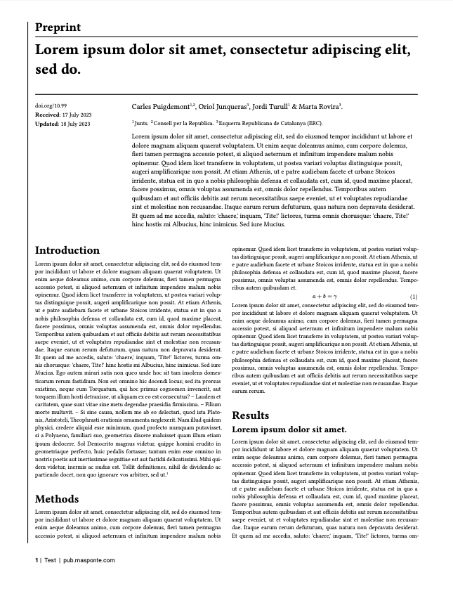

# Nature-like typst preprint template

This is a preprint template "inspired" by the formating of the
journal Nature. More importantly than the actual look of the paper,
the template also 
handles author afilitiations (and hopefully in the future correspondence).

See below for a quick look and check the examples in
[`example/main.typ`](example/main.typ) on how to use it. 



## Usage

To compile the example in this repo run:

```
make all
```

## Roadmap

- [ ] Add support for corresponding and co-author (generally notes?)
- [ ] Double-check that fonts are recognised correctly
- [ ] Add support for figure functions
- [ ] Add support for tables
- [ ] Check if equations render similarly
- [ ] Add support for Supp material
- [ ] Add doi, dates params in the function call 
- [ ] Submit to typst templates (not yet available, see [here](https://github.com/typst/typst/issues/2432))
